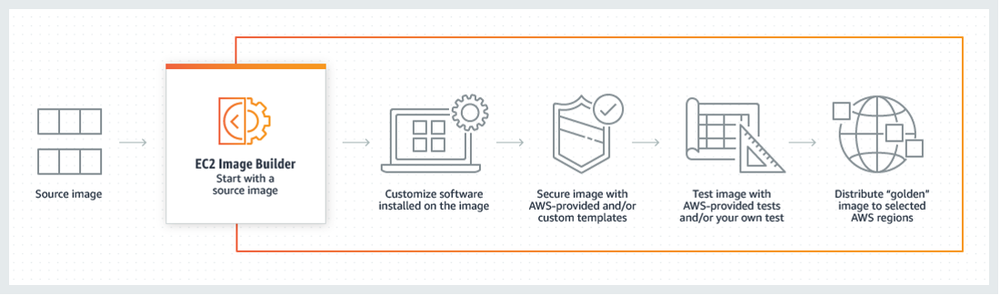

# aws-hardening-golden-ami

## Building CIS hardened Golden Images with EC2 Image Builder
[AWS Image Builder](https://docs.aws.amazon.com/imagebuilder/latest/userguide/what-is-image-builder.html) allows us to create, maintain, and distribute golden images for applications and infrastructure across accounts in an automated way. Now, you can use AWS Marketplace AMIs in EC2 Image Builder Console and use those AMIs as base images in the image build workflows. This makes it easier to seamlessly track and integrate AWS Marketplace AMI subscriptions in image customization workflows.

You can deploy CIS Benchmark hardening components via EC2 Image Builder. This gives you the ability to customize the baseline CIS image, and still being able to get to CIS standards baseline. This launch provides a streamlined approach to image hardening by eliminating the need to design, build, and test hardening components.

## Configuration
1. Create a S3 bucket and upload build kits in S3 bucket
2. Create IAM Role and attach any required policies
3. Create build components for Image Recipe
    - Choose a base image for customizations
    - Add any necessary software from the base image
    - Customize settings and scripts 
    - Get a CIS hardening component from S3
    - Execute hardening script as root or Administrator
    - Clean up
4. (Optional) Create a custom test components 
    - Run tests on the new image to ensure stability. Examples of the test may include to test that AMI can boot, application can be run, and test specific patch or security policy has been applied
5. Create infrastructure configurations
    - Select IAM role with the required permissions
6. Create distribution settings
    - Include specific regional settings, launch permissions, accounts that can launch the output AMI and the output AMI name
    - You will need to create new IAM Role to distribute AMIs to AWS Regions and AWS accounts
7. Create EC2 Image Builder pipeline from hardening recipe
8. Trigger the pipeline

## Automating CIS Audit with CIS-CAT Pro Assessor
You can automate and leverage CIS-CAT Pro Assessor for compliance audit with all available CIS Benchmarks [here](https://github.com/CISecurity/CCPA-Docs/blob/master/docs/Coverage%20Guide.md#cis-benchmark-coverage) during pre-remediation or post-remediation (or both). Make sure you have the appropiate SecureSuite license to unlock full feature and content access for CIS-CAT Pro Assessor. 

Create new component and attach to the Image Recipe:
1. Upload CIS-CAT Pro Assessor to S3 bucket
2. Automate the `(Assessor-CLI.bat|.sh)` script as root, Administrator, or an equivalently privileged principal
3. Upload audit report into S3 bucket
> Refer to user guide for more information 
